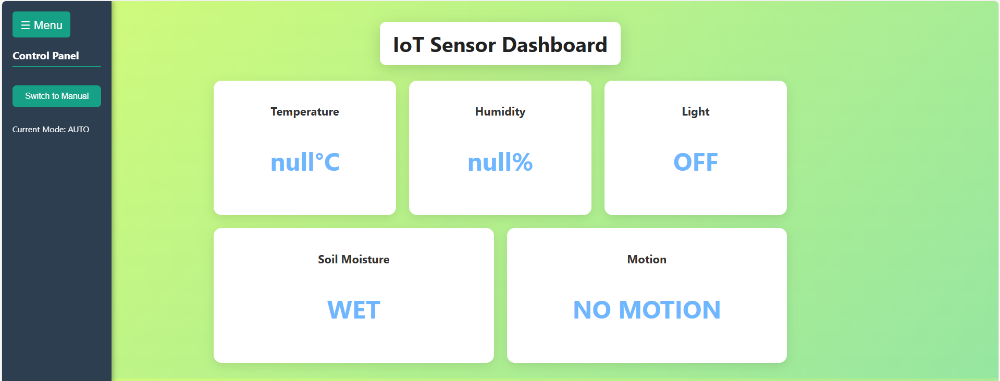
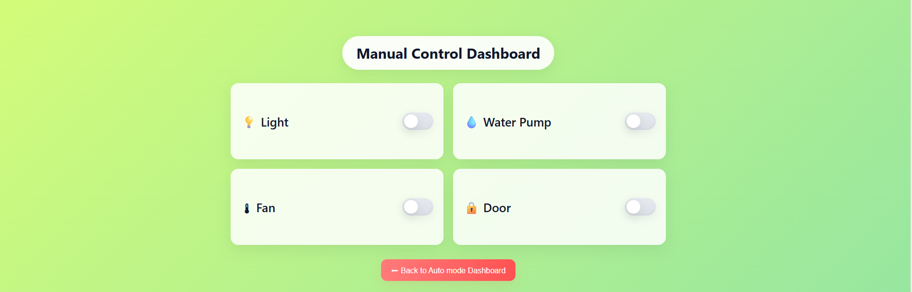
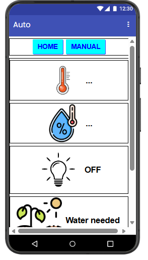
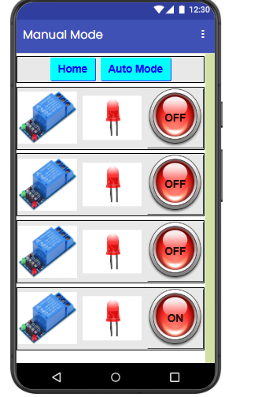
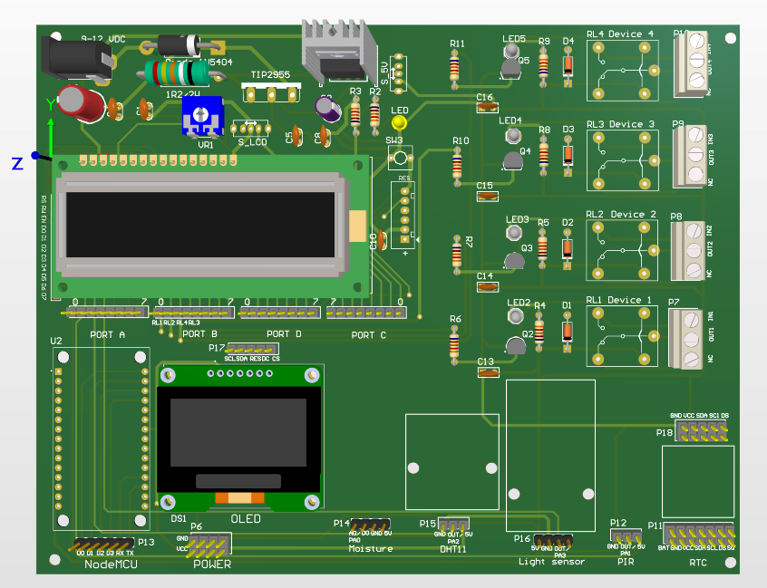
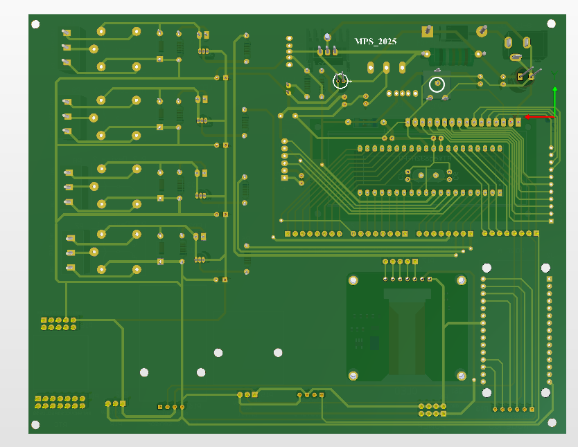
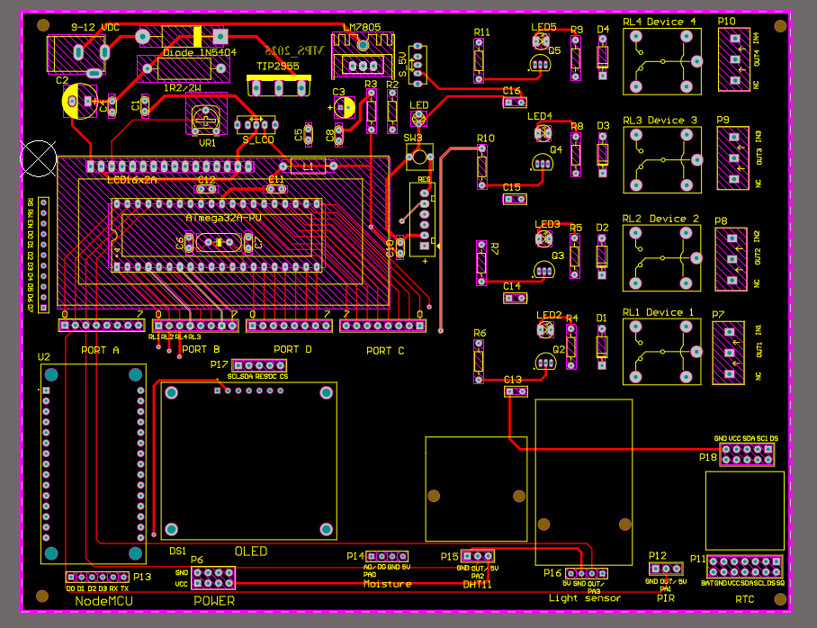
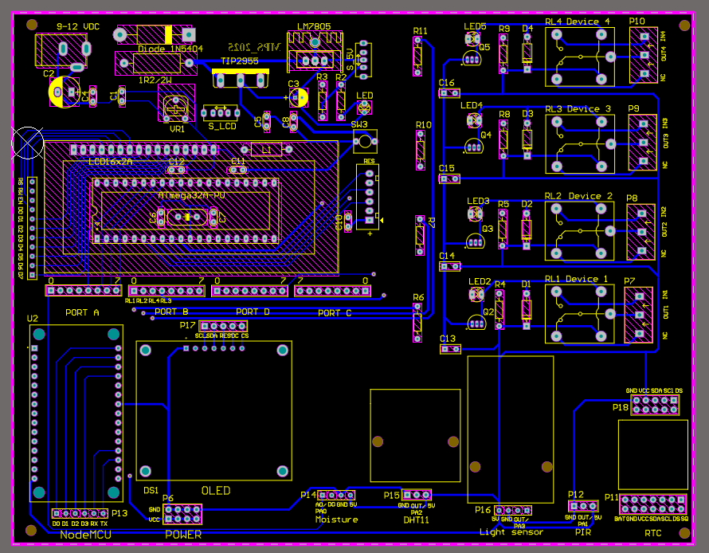

# Smart Agriculture IoT Gateway (ATmega32 & ESP8266)

**Project Overview:** Developed a complete end-to-end Smart Agriculture IoT system. The gateway acquires real-time environmental data and enables remote actuator control (relays) via a custom web interface and a mobile application, with data synchronized through Firebase.

**Key Technical Implementations:**
* **Hardware:** Designed a 2-layer data acquisition and control board integrating an ATmega32 (Core processing) and an ESP8266 (Wi-Fi module).
* **Firmware:** Developed bare-metal C firmware managing multiple peripherals. Utilized UART for MCU-to-MCU communication, I2C for LCD interfaces, and SPI for OLED local monitoring.
* **IoT & Cloud:** Configured the ESP8266 to parse and transmit JSON payloads to Firebase Realtime Database.
* **User Interface:**
  * Built a responsive Web Dashboard using HTML, CSS, and JavaScript.
  * Developed a mobile Android application using MIT App Inventor for seamless manual/auto mode control.

## 📋 Hardware Resources
* 📄 **System Schematic (PDF):** [View Schematic PDF](Schemati.pdf)
* 📊 **Bill of Materials (BOM):** [View BOM File](Bom.pdf)

## 💻 Software & User Interface

| Interface | Image |
| :--- | :--- |
| **Web Dashboard** |  |
| **Web Relay Control** |  |
| **Mobile App - Auto Mode** |  |
| **Mobile App - Manual Mode** |  |

## 🛠️ Hardware Design

| View | Image |
| :--- | :--- |
| **3D PCB Render (Top)** |  |
| **3D PCB Render (Bottom)** |  |
| **PCB Layout Top** |  |
| **PCB Layout Bottom** |  |
